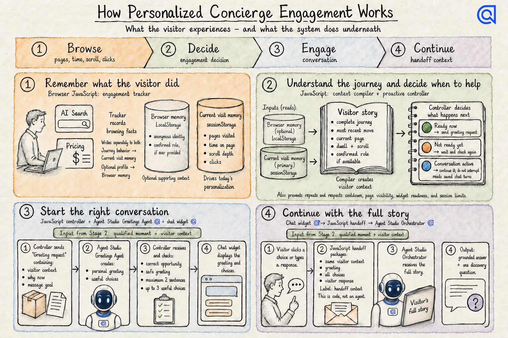
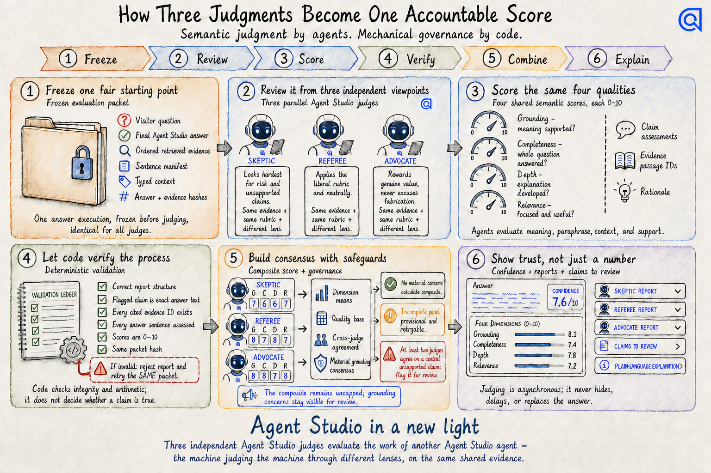

# Arijit Skills · v3.2

**44 skills · 5 folders · Modular pipeline architecture**

A suite of portable AI skills for Claude Code, Codex, Hermes, and related agent runtimes. Includes Algolia account and audit workflows plus general skills for partner intelligence, prompt shaping, visual explanation, video-to-methodology extraction, and durable knowledge capture.

---

## Featured Documentation

### Sketch Explainer

Professional hand-drawn explainers for business and technical audiences, with semantic color systems, executive restraint, exact brand assets, cross-asset visual consistency, and baseline-safe revisions.

**[Open the complete Sketch Explainer guide →](skills/general-skills/sketch-explainer/README.md)**

| Personalized concierge engagement | Three-judge quality framework |
|---|---|
| [](skills/general-skills/sketch-explainer/examples/how-personalized-concierge-engagement-works.png) | [](skills/general-skills/sketch-explainer/examples/how-judges-work.png) |

---

## Quick Install

```bash
git clone https://github.com/arijitchowdhury80/arijit-skills.git
cd arijit-skills
chmod +x install.sh && ./install.sh
```

The installer copies all skills to `~/.claude/skills/` and sets up your audit workspace.

To install only the learn-from-yt skill for Codex, Claude Code, or Hermes:

```bash
cd skills/general-skills/learn-from-yt
chmod +x install-skill.sh
./install-skill.sh --all
```

---

## Folder Structure

```
skills/
├── algolia-audit-skills/     ← 23 skills — full audit pipeline + intelligence modules
├── algolia-branding-skills/  ← 14 skills — brand content, collateral, and shared reference
├── algolia-data-enrichment/  ←  1 skill  — grounded index enrichment (CLI + Python package)
├── detect-search/             ←  1 skill  — search technology detection
└── general-skills/           ←  5 skills — general sales, prompting, media, knowledge, and visual tools
```

> **Note for developers:** The installer flattens this into `~/.claude/skills/` — the subfolders are for organization only. Claude Code behavior is unchanged.

---

## `algolia-audit-skills/` — Audit Pipeline

Everything needed to run a full Algolia Search Audit on a prospect, from raw research through to published deliverables.

### Architecture

```
algolia-search-audit (orchestrator)
│
├── WAVE 1 — 11 intelligence modules run in parallel:
│   ├── algolia-intel-company          Company overview, executives, vertical
│   ├── algolia-intel-techstack        Search vendor, ecommerce platform, CDN, analytics
│   ├── algolia-intel-traffic          SimilarWeb: visits, bounce, channels, demographics
│   ├── algolia-intel-competitors      Who competes, what search tech they use, Golden Angle
│   ├── algolia-intel-financial-public  Yahoo Finance: 3-year revenue, margins, analyst ratings
│   ├── algolia-intel-financial-private 6-source revenue waterfall for private companies
│   ├── algolia-intel-investor         Verbatim exec quotes from earnings calls + 10-K
│   ├── algolia-intel-hiring           LinkedIn Jobs: open roles, buying committee signals
│   ├── algolia-intel-social           LinkedIn + Twitter/X posts: exec strategic signals
│   ├── algolia-intel-news             Google News: leadership changes, tech investments
│   ├── algolia-intel-partner          Crossbeam: tech partners + SI/agency relationships
│   └── algolia-intel-industry         Baymard/Forrester benchmarks, vertical trends
│
├── WAVE 2 — depends on Wave 1:
│   └── algolia-intel-queries          14-18 vertically-calibrated browser test queries
│
├── LAYER 2 — Browser Audit:
│   └── algolia-audit-browser          20 search behavior tests, WAF bypass, screenshots
│
├── LAYER 3 — Synthesis:
│   ├── algolia-synth-business-case    6-component ROI model (conversion, AOV, bounce, etc.)
│   ├── algolia-synth-sales-plays      AE/BDR playbook: MEDDPICC, objections, talk track
│   ├── algolia-audit-report           Scoring + all 8 deliverables (SPA, deck, PDF, etc.)
│   └── algolia-campaign-abx           5-email sequence, LinkedIn messages, Loom script
│
└── LAYER 4 — Quality Gate:
    └── algolia-audit-factcheck        20-dimension verification → PROCEED/WARN/BLOCKED
```

### Skills Reference

| Skill | Purpose | MCP Required |
|-------|---------|-------------|
| `algolia-search-audit` | **Orchestrator.** Pure router — calls all 15 modules in wave order. Entry point for all audits. | All |
| `algolia-intel-company` | Company overview, founding, HQ, executive team, vertical classification | WebSearch |
| `algolia-intel-techstack` | Current search vendor, ecommerce platform, analytics stack, CDN/WAF, removed tech | BuiltWith |
| `algolia-intel-traffic` | Monthly visits, bounce rate, device split, channel breakdown, top keywords | SimilarWeb |
| `algolia-intel-competitors` | Competitor matrix, search vendor per competitor, Golden Angle detection | BuiltWith, SimilarWeb |
| `algolia-intel-financial-public` | 3-year revenue trend, EBITDA margin, analyst ratings, earnings call quotes | Yahoo Finance |
| `algolia-intel-financial-private` | Revenue estimate via 6-source waterfall (ecdb, Crunchbase, LinkedIn, trade press) | WebSearch |
| `algolia-intel-investor` | Verbatim exec quotes from earnings calls, 10-K MD&A, investor presentations | WebFetch |
| `algolia-intel-hiring` | ICP-relevant open roles, buying committee map, vacancy signals | Apify |
| `algolia-intel-social` | LinkedIn + Twitter/X posts scored for Algolia relevance | Apify |
| `algolia-intel-news` | Leadership changes, funding, tech investments from Google News + RSS | Apify |
| `algolia-intel-partner` | Tech partner overlaps (Adobe, Salesforce, etc.) + SI/agency relationships | Crossbeam |
| `algolia-intel-industry` | Vertical benchmarks, analyst quotes, industry search trends | WebSearch |
| `algolia-intel-queries` | 14-18 test queries calibrated to the prospect's vertical and product catalog | None |
| `algolia-audit-browser` | 20 browser tests: NLP, typo tolerance, facets, federated, recommendations | Chrome |
| `algolia-synth-business-case` | ROI model: conversion lift, AOV, bounce reduction, no-results, speed, long-tail | None |
| `algolia-synth-sales-plays` | Personalized AE playbook from exec quotes: MEDDPICC, discovery Qs, objections | None |
| `algolia-audit-report` | Scores 10 search areas + renders 8 deliverables (SPA, AE report, battle card, PDF) | None |
| `algolia-campaign-abx` | 5-email ABX sequence, LinkedIn messages, Loom video script | None |
| `algolia-audit-factcheck` | Verifies 20 dimensions across all deliverables → confidence gate | WebFetch |
| `algolia-audit-eval` | Quality scorer for any module output (5 dimensions, 7.0 pass threshold) | None |
| `algolia-audit-research` | *(Legacy)* Original monolithic research skill. Kept as standalone fallback. | All |
| `algolia-live-signals` | Targeted Apify scraper for hiring, social, and news signals for one company | Apify |

### Required MCP Servers

Add to `~/.claude/settings.json`:

```json
{
  "mcpServers": {
    "apify": {
      "command": "npx",
      "args": ["@apify/actors-mcp-server"],
      "env": { "APIFY_TOKEN": "YOUR_APIFY_TOKEN" }
    },
    "chrome": {
      "command": "npx",
      "args": ["-y", "chrome-devtools-mcp"]
    },
    "similarweb-mcp": {
      "command": "npx",
      "args": ["-y", "mcp-remote@latest", "https://mcp.similarweb.com/",
               "--header", "api-key: YOUR_SIMILARWEB_KEY"]
    },
    "builtwith": {
      "command": "node",
      "args": ["PATH_TO/bw-mcp-v1.js"],
      "env": { "BUILTWITH_API_KEY": "YOUR_BUILTWITH_KEY" }
    },
    "yahoo-finance-mcp": {
      "command": "uv",
      "args": ["--directory", "PATH_TO/yahoo-finance-mcp", "run", "python", "server.py"]
    }
  }
}
```

| Service | Used For | Get Key |
|---------|---------|---------|
| **Apify** | LinkedIn Jobs, social posts, Google News | [apify.com](https://apify.com) → Settings → API token |
| **SimilarWeb** | Traffic analytics | [similarweb.com/corp/developer](https://www.similarweb.com/corp/developer/) |
| **BuiltWith** | Tech stack detection | [api.builtwith.com](https://api.builtwith.com) |
| **Yahoo Finance MCP** | Financial statements + stock data | Open source — no key |
| **Chrome DevTools MCP** | Browser automation | No key needed |

---

## `algolia-branding-skills/` — Brand & Marketing Content

Skills for creating Algolia-branded content across all formats. All thirteen read their brand data
from a single shared reference library, so a stat or product name is corrected in one file and every
skill picks it up.

**This folder is self-contained and distributable on its own** — see
[`skills/algolia-branding-skills/README.md`](skills/algolia-branding-skills/README.md) for the
colleague-facing guide, the two-theme system, and how to keep brand values current. It ships its own
installer (`skills/algolia-branding-skills/install.sh`) that needs no MCP servers, API keys, or
workspace setup.

| Skill | Purpose |
|-------|---------|
| `algolia-brand-check` | Scans any content for brand compliance across 7 dimensions. Returns 1-10 score with specific fixes. |
| `algolia-algolialize` | Transforms any text, slide, or document into Algolia brand voice and tone. |
| `algolia-blog` | Writes SEO-optimized blog posts with meta descriptions, CTAs, and social snippets. |
| `algolia-brief` | Creates campaign briefs for Marketing and ABX teams from a prompt or opportunity context. |
| `algolia-case-study` | Builds customer case studies using the challenge → solution → results framework. |
| `algolia-deck` | Creates presentation decks with speaker notes, formatted for Google Slides. |
| `algolia-email` | Writes branded email templates for campaigns, product updates, and nurture sequences. |
| `algolia-landing` | Generates landing page copy and HTML with conversion optimization. |
| `algolia-one-pager` | Creates executive one-pagers, product overviews, or leave-behind summaries. |
| `algolia-partner` | Produces co-branded partner materials: solution briefs, integration guides, co-marketing. |
| `algolia-social` | Writes LinkedIn and Twitter/X posts optimized for Algolia's brand voice. |
| `algolia-ui-copy` | Writes UI microcopy: buttons, tooltips, error messages, empty states, onboarding. |
| `algolia-boilerplate` | Returns approved company descriptions, taglines, and boilerplate copy. |
| `algolia-shared-reference` | **Not directly invocable.** The single source of truth the 13 skills read at runtime: tokens, approved stats, product names, messaging, and Algolia's Figma section library. |

---

## `algolia-data-enrichment/` — Grounded Index Enrichment

Adds `abstract_enriched` and `keyhighlights_enriched` to Algolia index records, where every
stored string is cut out of the source page by a script rather than written by a model. The LLM
returns integers into a numbered menu; it never emits content, so fabrication is unrepresentable
rather than merely unlikely.

Unlike the other entries here, this is not a single `SKILL.md` — it is a 17-command CLI over an
internal Python package with 163 tests, and it has its own installer.

```bash
cd skills/algolia-data-enrichment
./install-skill.sh
```

| | |
|---|---|
| Writes | only to a named parallel index. Zero production search results changed |
| Verification | 163 tests + 4 evaluation gates, including an independently written grounding checker |
| Docs | [README](skills/algolia-data-enrichment/README.md) · [architecture](skills/algolia-data-enrichment/docs/ARCHITECTURE.md) · [commands](skills/algolia-data-enrichment/docs/COMMANDS.md) · [operations](skills/algolia-data-enrichment/docs/OPERATIONS.md) · [design decisions](skills/algolia-data-enrichment/docs/DESIGN-DECISIONS.md) |
| Source materials | the build [spec, goal prompt and eval log](skills/algolia-data-enrichment/docs/source/) are versioned with it |

Needs Python 3.10+, PyYAML, and credentials in your project's `.env.local` — an Algolia app and
admin key, a Scout key for page fetching, and an inference endpoint for the writer and judge.

---

## `general-skills/` — General WorkOS, Sales & Project Tools

Standalone skills that support project work, sales workflows, prompt shaping, durable knowledge extraction, and visual explanation.

| Skill | Purpose |
|-------|---------|
| `partnerforge` | Partner Intelligence Platform for Algolia Sales. Finds companies using partner technologies (Adobe AEM, Amplience, Spryker, etc.) who are NOT using Algolia — displacement opportunities for co-sell motions. |
| `prompt-shaper` | Turns long, unstructured, stream-of-consciousness input into an execution-ready prompt without losing requirements, constraints, or intent. |
| `record-knowledge` | Captures session evidence, decisions, reusable lessons, and project knowledge with a compact recording receipt. |
| [`sketch-explainer`](skills/general-skills/sketch-explainer/README.md) | Creates professional hand-drawn explainers for business and technical audiences, with semantic color, restrained executive illustration, exact brand assets, cross-asset consistency, and baseline-safe revisions. |
| `learn-from-yt` | Turns long videos, podcasts, courses, calls, or lectures into knowledge bases, business methodologies, SOPs, execution checklists, and downstream software/research requirements. Portable across Codex, Claude Code, and Hermes. |

---

## Audit Output

Each audit produces a complete package:

```
$ALGOLIA_AUDIT_DIR/{CompanyName}/
├── research/
│   ├── 01-company-context.md       ← Company overview + executives
│   ├── 02-tech-stack.md            ← Search vendor + platform detection
│   ├── 03-traffic-data.md          ← SimilarWeb traffic profile
│   ├── 04-competitors.md           ← Competitor matrix + Golden Angle
│   ├── 05-test-queries.md          ← Browser test query set
│   ├── 06-industry-intel.md        ← Vertical benchmarks
│   ├── 07-partner-intel.md         ← Partner + SI landscape
│   ├── 08-financial-profile.md     ← Revenue + margins + exec quotes
│   ├── 09-browser-findings.md      ← 20 browser test observations
│   ├── 09b-social-signals.md       ← LinkedIn/Twitter signals
│   ├── 09c-news-signals.md         ← Recent news coverage
│   ├── 09d-hiring-signals.md       ← Open roles + buying committee
│   ├── 11-investor-intelligence.md ← Earnings call quotes
│   └── FACTCHECK_GATE.md           ← PROCEED / WARN / BLOCKED
└── deliverables/
    ├── {slug}-audit-data.json      ← Master data (source of truth)
    ├── {slug}/index.html           ← Interactive SPA (5 tabs)
    ├── {slug}-ae-report.html       ← AE action card
    ├── {slug}-battle-card.html     ← Feature comparison
    ├── {slug}-leave-behind.html/pdf ← Prospect-facing
    ├── {slug}-ae-precall-brief.md  ← Pre-call brief
    ├── {slug}-strategic-signal-brief.md
    ├── {slug}-business-case.md     ← ROI model
    ├── {slug}-playbook.md          ← AE/BDR sales playbook
    └── abx-campaign/               ← Email sequence + LinkedIn messages
```

---

## Prerequisites

```bash
node --version    # 18+
deno --version    # 1.4+
npm install -g vercel
npm install -g @apify/actors-mcp-server
```

For `learn-from-yt`, use Python 3 plus optional media tools: `yt-dlp`, `ffmpeg`, and `youtube-transcript-api`.

---

## License

Personal and internal agent skills. Review each skill's README and dependencies before external use.
Built with Claude Code (claude-sonnet-4-6) · v3.0 · 2026-03-23
