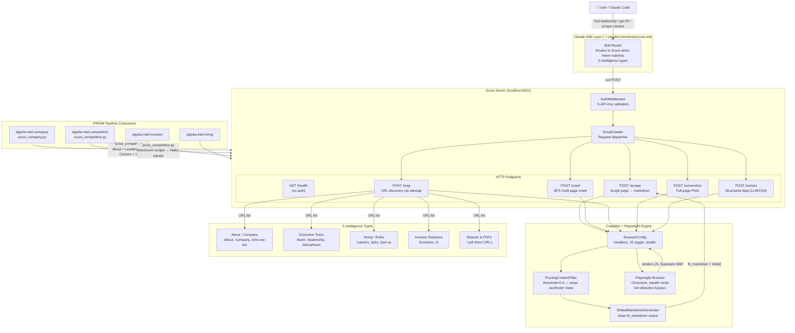
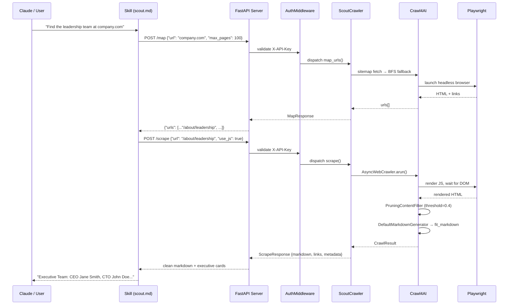

# Scout — Architecture

## System Overview

Scout is a three-layer system: a **Claude skill** that routes Claude's intent, a **FastAPI server** that exposes five HTTP endpoints, and a **Crawl4AI/Playwright engine** that does the actual crawling.



---

## Data Flow: Single Scrape Request



---

## File Structure

```
Scout/                          ← server repo (separate from skills repo)
├── scout/
│   ├── api/
│   │   ├── main.py             ← FastAPI app, lifespan startup
│   │   ├── config.py           ← Settings (SCOUT_API_KEY, PORT=8421)
│   │   ├── deps.py             ← get_crawler() DI factory
│   │   ├── middleware/
│   │   │   └── auth.py         ← API key gate
│   │   └── routers/
│   │       ├── scrape.py       ← POST /scrape
│   │       ├── map.py          ← POST /map
│   │       ├── crawl.py        ← POST /crawl
│   │       ├── extract.py      ← POST /extract
│   │       ├── screenshot.py   ← POST /screenshot
│   │       └── health.py       ← GET /health
│   ├── core/
│   │   ├── crawler.py          ← ScoutCrawler (dispatcher)
│   │   ├── types.py            ← Pydantic contracts (source of truth)
│   │   └── modes/
│   │       ├── scrape.py       ← single page fetch
│   │       ├── map.py          ← URL discovery
│   │       ├── crawl.py        ← BFS multi-page
│   │       ├── extract.py      ← structured extraction
│   │       └── screenshot.py   ← visual capture
│   ├── cli.py                  ← scout serve / scrape / map / crawl
│   └── skill/
│       └── scout.md            ← canonical skill (source of truth)
├── .env.example
├── install-skill.sh            ← copies skill → ~/.claude/commands/
└── pyproject.toml              ← pip install -e .

algolia-claude-skills/          ← this repo
└── skills/algolia-audit-skills/scout/
    ├── SKILL.md                ← distributable skill copy
    ├── README.md               ← install + usage guide (this file's companion)
    └── ARCHITECTURE.md         ← this file
```

---

## Security Notes

- The `AuthMiddleware` rejects all requests (except `/health`) without a valid `X-API-Key` header.
- The default `dev-key` is acceptable for local single-user development. Set a real key in `.env` before exposing the server on any shared or network-accessible interface.
- Scout does not store scraped content to disk — all results are returned in the HTTP response and discarded after the request completes.
- Scout does not follow authentication redirects or submit credentials. It scrapes only publicly accessible content.
