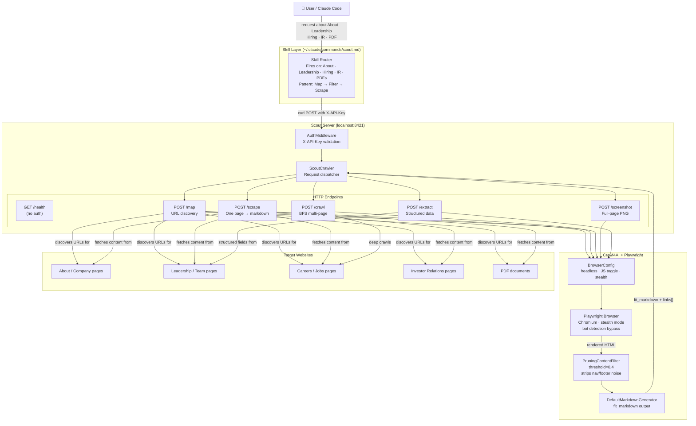
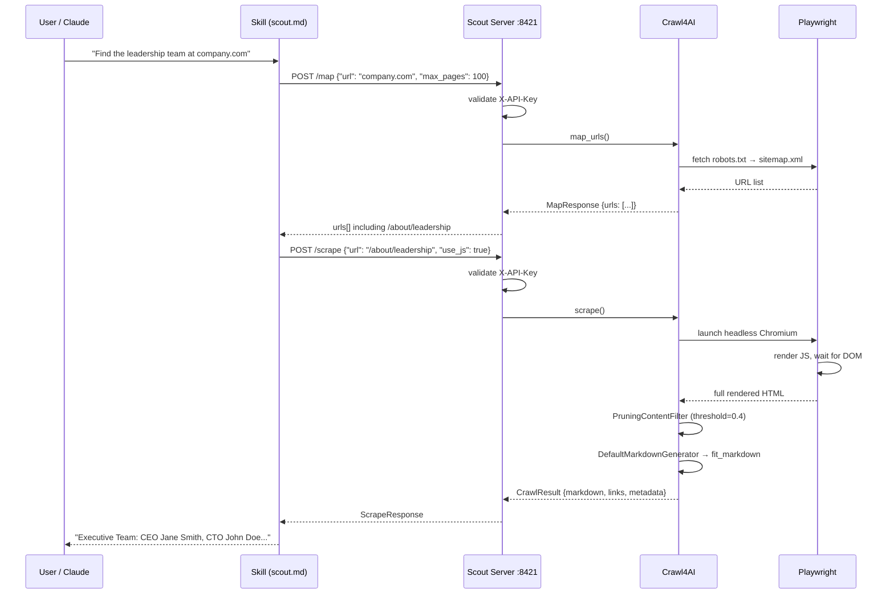

# Scout — Architecture

## System Overview

Scout is three layers: a **Claude skill** that routes intent, a **FastAPI server** that exposes five HTTP endpoints, and a **Crawl4AI + Playwright engine** that does the crawling.



---

## Scrape Request — Sequence Diagram



---

## Server File Structure

```
Scout/
├── scout/
│   ├── api/
│   │   ├── main.py             ← FastAPI app entry point + lifespan startup
│   │   ├── config.py           ← Settings loaded from .env
│   │   │                         SCOUT_API_KEY (default: dev-key)
│   │   │                         PORT (default: 8421)
│   │   │                         LLM_API_KEY (optional, for /extract)
│   │   ├── deps.py             ← get_crawler() DI factory
│   │   ├── middleware/
│   │   │   └── auth.py         ← API key gate (all endpoints except /health)
│   │   └── routers/
│   │       ├── health.py       ← GET /health
│   │       ├── scrape.py       ← POST /scrape
│   │       ├── map.py          ← POST /map
│   │       ├── crawl.py        ← POST /crawl
│   │       ├── extract.py      ← POST /extract
│   │       └── screenshot.py   ← POST /screenshot
│   ├── core/
│   │   ├── crawler.py          ← ScoutCrawler — thin dispatcher
│   │   ├── types.py            ← Pydantic request/response models (source of truth)
│   │   └── modes/
│   │       ├── scrape.py       ← single page fetch via Crawl4AI
│   │       ├── map.py          ← URL discovery via sitemap + BFS
│   │       ├── crawl.py        ← BFS multi-page crawl
│   │       ├── extract.py      ← LLM/CSS structured extraction
│   │       └── screenshot.py   ← Playwright visual capture
│   ├── cli.py                  ← scout serve / scrape / map / crawl / extract / screenshot
│   └── skill/
│       └── scout.md            ← canonical skill (source of truth for this file)
├── .env                        ← your local config (not committed)
├── .env.example                ← template
├── install-skill.sh            ← copies skill → ~/.claude/commands/scout.md
├── pyproject.toml              ← pip install -e .
└── tests/
    ├── unit/                   ← mocked, fast
    └── integration/            ← live network + browser
```

---

## Key Design Decisions

**Why a local server instead of a Python library called directly?**
Claude Code calls tools via Bash. A local HTTP server is the cleanest interface — it works the same way whether Claude calls it via curl, the CLI calls it directly, or an external script calls it. No Python import path issues, no async runtime conflicts.

**Why Crawl4AI instead of raw Playwright/Requests?**
Crawl4AI handles the messy middle layer: JS rendering, content pruning (`PruningContentFilter`), and markdown generation. Scout adds auth, request routing, Pydantic contracts, and stealth configuration on top.

**Why is `/map` separate from `/scrape`?**
Discovering URLs is cheap (sitemap fetch + BFS). Scraping is expensive (full browser render per page). Separating the two lets Claude pick exactly which pages to scrape rather than downloading everything blindly.

**Why is `stealth` opt-in instead of always-on?**
Stealth mode (`enable_stealth + simulate_user + magic` in Crawl4AI) adds latency and memory overhead. Static pages don't need it. The skill enables it selectively for JS-heavy and bot-protected pages.

---

## Security Notes

- All endpoints except `GET /health` require a valid `X-API-Key` header.
- The default `dev-key` is for local development only. Set `SCOUT_API_KEY` to a real secret before exposing the server on any shared or network-accessible interface.
- Scout does not persist scraped content to disk. All data is returned in the HTTP response and discarded after the request completes.
- Scout only fetches publicly accessible content. It does not follow authentication redirects or submit credentials.
