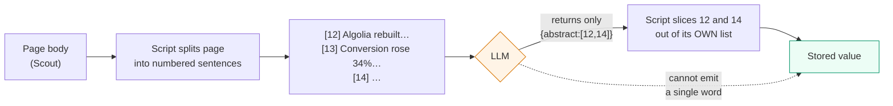
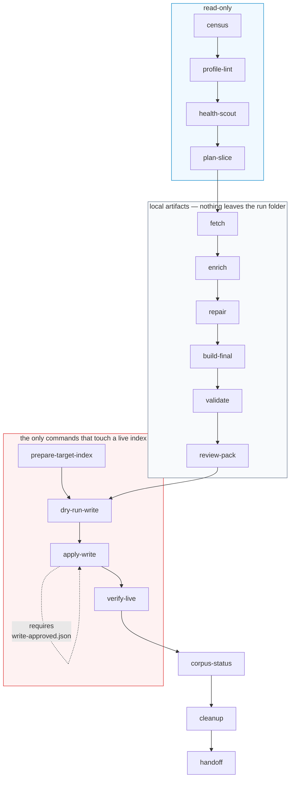

# algolia-data-enrichment

Add grounded `abstract_enriched` and `keyhighlights_enriched` fields to Algolia index records —
where **grounded** means every stored string was cut out of the source page by a script, not
written by a model.

The LLM never types content. It reads a numbered menu the script built from the page and returns
integers. Fabrication is not detected, it is unrepresentable: an integer either indexes a real
sentence from that page or it is out of range.

```
Status   v0, method proven on 20 records across 2 sources and 3 languages.
Scale    Designed for a 11,928-record corpus; largest slice run so far is 10.
Writes   Only to a named parallel index. Zero production search results changed.
Tests    163, all green. Plus 4 evaluation gates — see docs/source/EVAL-LOG.md.
```

---

## What problem this solves

A search index full of records whose `description` is a marketing blurb, or empty, or identical
to the title. Search cannot rank what it cannot read.

The obvious fix — ask an LLM to summarise each page — produces text that is fluent, plausible,
and occasionally invented. On a corpus of thousands of records nobody will read them all, so a
hallucination ships and stays.

This skill removes the possibility rather than testing for it.



Everything else — fetch, canonicalisation, candidate slicing, grounding, repair, validation,
payload building, write control, live verification — is deterministic Python that produces the
same result on a re-run.

---

## Install

```bash
git clone https://github.com/arijitchowdhury80/arijit-skills.git
cd arijit-skills/skills/algolia-data-enrichment
./install-skill.sh
```

Then restart Claude Code. The installer copies the skill to `~/.claude/skills/`, checks Python
and PyYAML, and runs the test suite so you find out immediately if something is wrong.

**Requirements**

| | |
|---|---|
| Python | 3.10+ (developed on 3.13) |
| Packages | `pyyaml`, `pytest` |
| Tools | `curl` — used instead of `urllib` because corporate TLS interception breaks certifi |
| Credentials | `.env.local` in your project root, never in this repo |

```bash
ALGOLIA_APP_ID=...
ALGOLIA_ADMIN_API_KEY=...
SCOUT_HOSTED_API_KEY=...              # the page fetcher
ALGOLIA_INFERENCE_BASE_URL=...        # writer + judge
ALGOLIA_INFERENCE_API_KEY=...
```

Credentials never enter a command line. They go to `curl` through its stdin config, because argv
is world-readable and a corpus run spawns one curl per page.

---

## Quickstart

```bash
cd .claude/.claude/skills/algolia-data-enrichment/scripts
WS=/path/to/your/project

# 1. What is in the index, and is every page_type profiled?
python3 algolia_enrich.py census       --workspace $WS
python3 algolia_enrich.py profile-lint --workspace $WS

# 2. Is the fetcher actually working? (a real job — /health lies)
python3 algolia_enrich.py health-scout --workspace $WS --probe-url /blog/some-post

# 3. Plan a bounded slice
RUN=20260810-blog-blog-post-a01
python3 algolia_enrich.py plan-slice --workspace $WS --run-id $RUN \
        --source Blog --page-type blog-post --limit 10

# 4. Run it
for cmd in fetch enrich build-final validate review-pack; do
  python3 algolia_enrich.py $cmd --workspace $WS --run-id $RUN \
          --source Blog --page-type blog-post
done

# 5. Write — needs an approval FILE, not a flag
python3 algolia_enrich.py prepare-target-index --workspace $WS --run-id $RUN
python3 algolia_enrich.py dry-run-write        --workspace $WS --run-id $RUN --source Blog --page-type blog-post
#   ... write runs/$RUN/approvals/write-approved.json ...
python3 algolia_enrich.py apply-write          --workspace $WS --run-id $RUN --source Blog --page-type blog-post
python3 algolia_enrich.py verify-live          --workspace $WS --run-id $RUN --source Blog --page-type blog-post
```

Full command reference: **[docs/COMMANDS.md](docs/COMMANDS.md)**.

---

## The pipeline



State transitions are enforced. `apply-write` cannot run unless `dry-run-write` passed;
`dry-run-write` cannot run unless `validate` passed.

---

## The five safety properties

These are structural, not procedural. Each one is a thing the code cannot do, rather than a rule
someone has to remember.

**1. The model cannot emit content.** It returns integers into a list the script built. There is
no code path from a model's string to a stored value.

**2. `enrich` cannot read a foreign cache.** It takes a run folder, never a cache path, and
refuses unless the run's own `fetch` sealed that cache with a manifest whose hashes still match.

**3. Nothing can write to the source index.** `assert_write_target` raises when target equals
source, and every write path calls it before a payload is even built.

**4. Only three fields can be written.** `objectID`, `abstract_enriched`,
`keyhighlights_enriched`. No provenance, no offsets, no verdicts, no model ids. A null is refused
outright — `partialUpdateObject` stores a literal null rather than removing an attribute.

**5. Zero work is a failure.** No command prints PASS after checking zero records or zero spans.
A verifier on the source project once filtered on a non-faceted attribute, matched nothing, and
reported success.

---

## Documentation

| Read this | When |
|---|---|
| **[docs/ARCHITECTURE.md](docs/ARCHITECTURE.md)** | understanding the module map and data flow |
| **[docs/COMMANDS.md](docs/COMMANDS.md)** | running anything — all 17 commands, inputs, outputs, refusals |
| **[docs/OPERATIONS.md](docs/OPERATIONS.md)** | running a real slice: approvals, run folders, failure recovery |
| **[docs/DESIGN-DECISIONS.md](docs/DESIGN-DECISIONS.md)** | asking "why is it done this way" — every answer is a defect that happened |
| **[references/](references/)** | loaded on demand by the agent, one file per concern |

### Source materials

The skill was built from a written spec by an autonomous agent against four evaluation gates.
All three source artifacts are versioned here so the build is auditable, not just the output:

| File | What it is |
|---|---|
| **[docs/source/PLAN-skill-algolia-corpus-enrichment.md](docs/source/PLAN-skill-algolia-corpus-enrichment.md)** | the 2,281-line build spec — command contracts, profiles, grounding contract, definition of done |
| **[docs/source/PROMPT-build-and-eval-skill.md](docs/source/PROMPT-build-and-eval-skill.md)** | the goal prompt — constraints, build order, the four gates, stop conditions |
| **[docs/source/EVAL-LOG.md](docs/source/EVAL-LOG.md)** | every iteration including the four that failed, with root causes |
| **[docs/source/independent_grounding.py](docs/source/independent_grounding.py)** | the Gate 2 checker, written to share no code with the validator it audits |

---

## Evaluation

Four gates, run in order, all must pass. Two iterations were needed.

| Gate | Checks | Result |
|---|---|---|
| **1** Unit + refusal | 163 tests; the source project's pre-existing 472 unchanged; all 17 commands have a refusal test that drives `main()` and asserts the exit code | PASS |
| **2** Independent grounding | a separately written checker, sharing no code with `validate/grounding.py`, re-verifies the prior corpus | **21,790 / 21,790** spans located — and the same mode partition (9,597 exact / 12,193 canonical) |
| **3** Write path | 10 records fetched → enriched → written → byte-verified live; enriched-only queries return hits | PASS |
| **4** Multilingual | 10 records, 4 de + 4 fr + 2 en, through every command | PASS, no systematic skew by language |

Gate 2 exists because the number being promoted was self-reported by the component being
promoted. A 100% pass from the thing under test is the weakest admissible evidence for it.

**What the gates do not measure: whether the abstracts are any good.** Grounding is a guarantee
and it is total. Selection quality is a judgement, it is unmeasured, and 20 records is below the
noise floor for this corpus. The review packs each run produces are the artifact for that
question, and answering it is a human's job.

---

## Naming

The folder and skill are `algolia-data-enrichment`. The internal Python package is
`algolia_enrichment`, and the source spec calls the project `algolia-corpus-enrichment` — that
name appears throughout `docs/source/`. Same thing, historical drift, not worth a rewrite of the
build record.

## Scope

**In:** fetch, enrich, repair, validate, write to an approved parallel index, human-review queue,
run-artifact hygiene.

**Out (deliberately):** changing production `searchableAttributes`, proving search-result lift,
automatic deletion, automatic quarantine, rollback state machines. Those need their own plan and
their own approval. See the v0 → v1 section of
[references/corpus-lifecycle.md](references/corpus-lifecycle.md).
