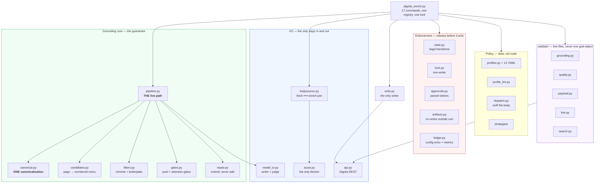
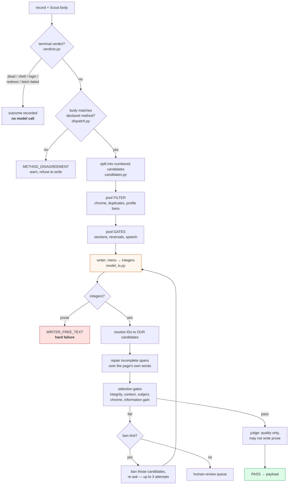
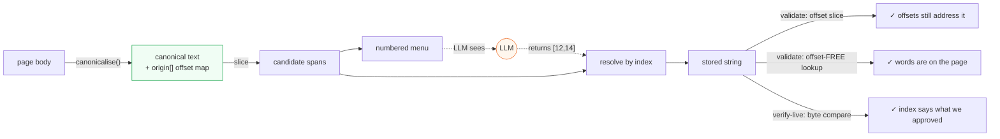

# Architecture

One CLI over an internal Python package. ~9,000 lines, replacing 40 loose scripts totalling
13,321 — of which 7,279 lines were deliberately dropped rather than carried.

The shape is not an aesthetic preference. The predecessor was a folder of scripts that agents
grabbed at random, and the three worst defects in its history were all shape defects: two
implementations of one function, a gate in a code path nothing called, and two programs joined
by a human running them in the right order.

---

## Layers



---

## One record, end to end

`pipeline.process_record()` is the only implementation of this. There is no second copy.



**Why pool gates run before selection.** A pool gate is a property of one *candidate* — its
section, the text after it, the text itself. Running those after selection quarantined 589 of
2,800 records in the predecessor, almost all of them pages holding forty other usable sentences.
If a verdict depends only on the page, ban the candidate; never the record.

**Why the retry ladder exists.** A gate failure names *which* sentence was wrong. That is enough
to narrow the menu and ask again, which is what a person would do. Asking once and quarantining
throws a page away to punish one sentence.

---

## The grounding chain

Every link is deterministic. The model appears once, and it appears as an integer.



`canonicalise()` is **purely subtractive**. It deletes formatting characters, collapses
whitespace, and folds typographic variants strictly 1:1 so the offset map stays exact. It cannot
introduce a word. That is what lets a canonical match still prove every word came off the page.

Both checks always run. The offset-free one is what matters — a stale offset is common and
harmless, a missing string is a fabrication — but offset-only would silently pass a span whose
offsets happen to land on different text after a re-fetch.

---

## Module map

### Grounding core

| Module | Lines | Owns |
|---|---:|---|
| `canonical.py` | 407 | `Canon`, `canonicalise()`, the offset map, `is_speech`, `detect_language`, `prose_chars`. **The coordinate system four stages share.** |
| `candidates.py` | 534 | Block → sentence → piece splitting, candidate classification, the menu, integer resolution |
| `filters.py` | 211 | Chrome/breadcrumb/cookie/code-comment patterns, duplicate-description detection, corpus-frequency boilerplate |
| `gates.py` | 633 | `locate`, pool gates (static bans, reversal repair), selection gates (integrity, context, subject, information gain), the retry ladder |
| `repair.py` | 216 | Incomplete-span detection and extension over contiguous source text |
| `pipeline.py` | 395 | **The live path.** Composes all of the above. |

### I/O

| Module | Lines | Owns |
|---|---:|---|
| `scout.py` | 233 | The only page fetcher. Served-URL identity, rate-limit backoff, real-job health check |
| `bodysource.py` | 210 | `BodySource` protocol, `ScoutRefetch`, `IngestPayload`, and `RunCache` — the fetch/enrich join |
| `model_io.py` | 330 | Writer prompt, judge prompt, retry/backoff, served-model pinning |
| `api.py` | 204 | Algolia REST, cursor pagination, credential-safe curl |

### Policy

| Module | Lines | Owns |
|---|---:|---|
| `profiles.py` | 246 | YAML loading, inheritance, validation, versioning by content hash |
| `profile_lint.py` | 89 | Coverage of every **live** page_type against the profile set |
| `dispatch.py` | 98 | Body-shape sniffer; declared method vs measured shape |
| `verdicts.py` | 184 | Dead / shell / login / redirect classification, decided by body not status |
| `strategies/` | 67 | Five enrichment methods; deliberately thin |

### Enforcement

`state.py` (legal transitions) · `lock.py` (one writer per run) · `approvals.py` (parsed tokens) ·
`artifacts.py` (no writes outside the run folder) · `ledger.py` (per-record outcomes, metrics,
effective-config echo) · `errors.py` (typed failures, all non-zero exit) · `config.py` (index
names as config) · `human_review.py` · `corpus.py` · `write.py` · `batching.py`

### Validation

Five modules, one registry of 17 named gates. The split is deliberate: the predecessor had
eleven separate verifier scripts, which is eleven incidents rather than a design.

---

## Run folder

One slice, one directory, nothing loose anywhere else.

```
runs/<YYYYMMDD-source-page_type-aNN>/
├── .lock                    PID, command, started_at
├── state.json               multi-track: fetch/enrich/repair/final/validate/write
├── manifest.json            exact objectIDs + the runtime projection
├── census-before.json       what the index looked like at planning time
├── effective-config.json    what the runner ACTUALLY loaded — printed, not inferred
├── fetch-manifest.json      seals the cache to this run id
├── ledger.jsonl             one row per record per stage
├── metrics.json             wall clock, per-record cost
├── cache-scout/             bodies this run's own fetch produced
├── outputs/base|repair/     results.jsonl
├── final/                   results · payloads · human-review-queue
├── validation/              coverage · grounding · payload · live · method-check
├── reports/                 packet.md · review-pack.md
├── approvals/  probes/  logs/  tmp/  archive/
```

The `aNN` attempt suffix is load-bearing: without it a same-day rerun of the same slice collides
on the folder and the lock.

---

## Three shapes worth understanding

### `canonical.py` is separate from `gates.py`

It is not a gate. It is the projection that candidate slicing, repair, artifact validation and
live verification all work in — four consumers, one normalisation. Both grounding failures in the
predecessor were two code paths normalising the same characters differently, and both times the
spans were faithful and the verifier was wrong.

Separation alone does not prevent that (the divergence was *within* one function), so
`test_canonical.py` asserts idempotence and branch parity directly.

### `run_gates()` is not ported

The predecessor had a record-level gate function that the runner never called, plus an inline
copy that it did. A gate was fixed inside the dead one twice — every unit test passed, the
pipeline behaved exactly as before.

Carrying it would carry the defect. `pipeline.evaluate_selection` is the single live path, and
`test_gate_wiring.py` proves a gate is *reached by the CLI* by driving the command and reading the
run's own output, not by importing the gate and calling it.

### `bodysource.py` joins two halves that were joined by a human

Measured by walking the import graph: the Scout-only fetcher — the thing enforcing the single most
important rule in the project — was not reachable from the live runner. Fetch was one program,
enrich another, and nothing verified that the bodies the runner read were the bodies the fetcher
wrote.

`enrich` now takes a run folder and refuses unless that run's own `fetch` sealed the cache. Every
body is checked against the source the **manifest** declares — not against the body's own claim
about itself, because a body that lies about its fetcher would otherwise skip the very check that
exists to catch it.
