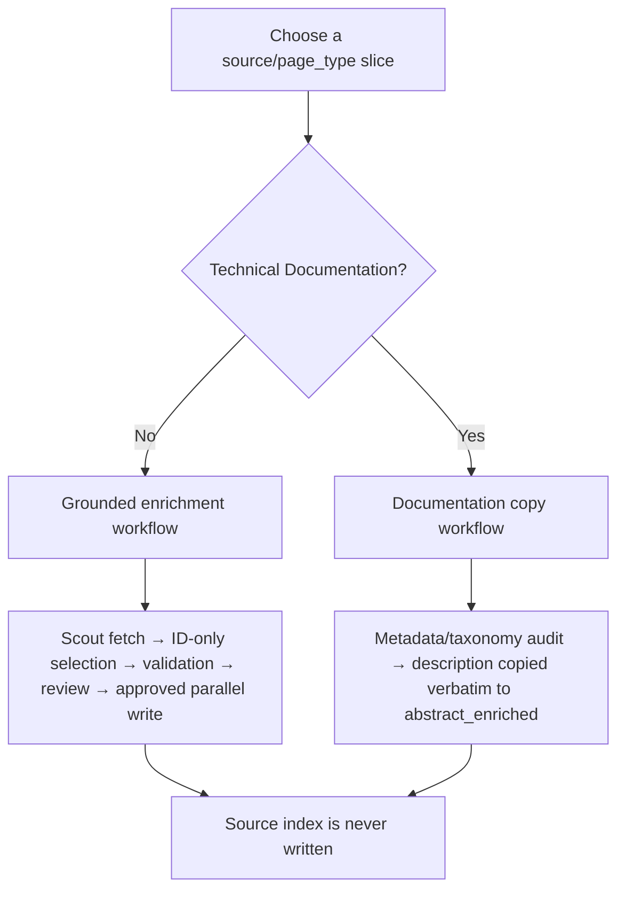
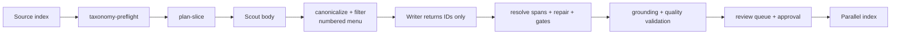

# User guide

This is a controlled ETL skill for enriching an Algolia content index. It improves retrieval
without allowing generated prose to enter the index.

## What it does

| Capability | Result |
|---|---|
| Grounded enrichment | `abstract_enriched` and `keyhighlights_enriched` are selected from page text, never model-written |
| Taxonomy preflight | validates the eight-axis Chapter 1 taxonomy contract before a slice starts |
| Source-aware routing | applies a profile for each `source/page_type`, with no silent fallback |
| Scout-only body ingestion | seals one run's fetched bodies and rejects foreign or altered cache data |
| Deterministic repair | extends a broken source cut with adjacent source words; it never writes new text |
| Validation | rejects source-missing text, chrome, boilerplate, duplicate descriptions, malformed spans, and unsafe payloads |
| Human-review handoff | preserves unresolved records and a suggested next action rather than quietly dropping them |
| Approval-gated delivery | writes approved fields only to a parallel index, then proves written data is queryable |

## Choose the workflow



Use grounded enrichment for Blogs, Customer Stories, Resources, Website, and other content-rich
pages. Use the Documentation copy workflow for definitive technical docs: it does not call Scout
or an LLM, never produces highlights, and only copies an existing nonblank `description`.

## The one executable entry point

Run only the CLI. The Python modules below it are internal implementation components, not loose
scripts to execute independently.

```bash
SKILL=/path/to/algolia-data-enrichment
WS=/path/to/your/project
CLI="$SKILL/scripts/algolia_enrich.py"
python3 "$CLI" --help
```

Every run writes only below `docs/70-enrichment/runs/<run-id>/` and exits `2` on an invariant
failure. A zero-record or zero-span pass is refused.

## Standard grounded-enrichment run

```bash
RUN=20260811-customer-stories-case-study-a01
SLICE=(--source "Customer Stories" --page-type case-study)

python3 "$CLI" census              --workspace "$WS"
python3 "$CLI" profile-lint        --workspace "$WS"
python3 "$CLI" taxonomy-preflight  --workspace "$WS" --run-id "$RUN"
python3 "$CLI" health-scout        --workspace "$WS" --probe-url /en/customers/example

python3 "$CLI" plan-slice  --workspace "$WS" --run-id "$RUN" "${SLICE[@]}" --limit 10
python3 "$CLI" fetch       --workspace "$WS" --run-id "$RUN" "${SLICE[@]}" --concurrency 4
python3 "$CLI" enrich      --workspace "$WS" --run-id "$RUN" "${SLICE[@]}" --concurrency 6
python3 "$CLI" repair      --workspace "$WS" --run-id "$RUN" "${SLICE[@]}"
python3 "$CLI" build-final --workspace "$WS" --run-id "$RUN" "${SLICE[@]}"
python3 "$CLI" validate    --workspace "$WS" --run-id "$RUN" "${SLICE[@]}"
python3 "$CLI" review-pack --workspace "$WS" --run-id "$RUN" "${SLICE[@]}"
```

Stop after `review-pack`. `validate` proves grounding and hygiene; the review pack is where a
human decides whether the selected excerpts are useful and representative.

## Documentation copy run

Documentation is deliberately different. It must not be summarized or elaborated by a model.

```bash
RUN=20260811-documentation-copy-a01
python3 "$CLI" taxonomy-preflight --workspace "$WS" --run-id "$RUN"
python3 "$CLI" audit-documentation --workspace "$WS" --run-id "$RUN"
python3 "$CLI" prepare-documentation-copy --workspace "$WS" --run-id "$RUN"
```

The output contains `documentation-copy/payloads.jsonl` with `objectID` and
`abstract_enriched: [description]`, plus a human-review queue for missing metadata. It produces
no highlights and makes no model or page-fetch call.

## Approval-gated parallel write

No command writes the source index. The final artifact can be written only to the configured
parallel index after a matching approval file exists.

```bash
python3 "$CLI" prepare-target-index --workspace "$WS" --run-id "$RUN"
python3 "$CLI" dry-run-write        --workspace "$WS" --run-id "$RUN" "${SLICE[@]}"
# Create runs/$RUN/approvals/write-approved.json from dry-run-write's actual counts.
python3 "$CLI" apply-write          --workspace "$WS" --run-id "$RUN" "${SLICE[@]}"
python3 "$CLI" verify-live          --workspace "$WS" --run-id "$RUN" "${SLICE[@]}"
```

`verify-live` compares the target index against the intended payload and queries enriched-only
text. A write receipt alone is never treated as evidence.

## Data flow and module map



| Layer | Modules | Responsibility |
|---|---|---|
| CLI and configuration | `algolia_enrich.py`, `config.py`, `api.py` | command dispatch, workspace configuration, Algolia REST access |
| Source identity | `scout.py`, `bodysource.py`, `verdicts.py` | Scout fetches, sealed bodies, served-URL/liveness/redirect decisions |
| Grounding core | `canonical.py`, `candidates.py`, `filters.py`, `gates.py`, `repair.py`, `pipeline.py` | eligible source text, ID resolution, repair, live selection path |
| Selection stability | `selection_registry.py` | freezes accepted candidate IDs by cleaned selection input |
| Taxonomy and policy | `taxonomy.py`, `profiles.py`, `profile_lint.py`, `dispatch.py`, `strategies/` | eight-axis schema, profile routing, source-specific behavior |
| Run safety | `artifacts.py`, `lock.py`, `state.py`, `ledger.py`, `approvals.py`, `batching.py`, `corpus.py` | isolated artifacts, locks, transitions, approvals, concurrency, reconciliation |
| Validation and delivery | `validate/`, `human_review.py`, `write.py` | grounding, quality, payload/live checks, review queue, parallel-index write |

## Artifacts that matter

| Artifact | Why it matters |
|---|---|
| `manifest.json` | exact planned objectIDs and profile identity |
| `cache-scout/` + `fetch-manifest.json` | sealed Scout bodies and hashes used as evidence |
| `effective-config.json` | profile, models, thresholds, canonical version, and body source |
| `final/payloads.jsonl` | only fields eligible for approved write |
| `final/human-review-queue.jsonl` | unresolved records, reasons, and reviewer action |
| `validation/` | grounding, quality, taxonomy, payload, coverage, and live reports |
| `artifact-manifest.json` | files produced by each command |

## What the guarantees mean

- **Grounded:** the model returns candidate IDs; the script stores matching source spans. A model
  word cannot reach the index.
- **Taxonomy-conformant:** eight-axis fields obey the schema. It does not claim each tag is
  editorially correct; sampled taxonomy review remains required.
- **Not automatically publishable:** review and a matching approval file are deliberate human
  decisions. The source index remains read-only regardless.

## Next references

| Need | Read |
|---|---|
| Exact arguments, outputs, and refusals | [COMMANDS.md](COMMANDS.md) |
| Run a real source slice and recover from errors | [OPERATIONS.md](OPERATIONS.md) |
| Internal components and boundaries | [ARCHITECTURE.md](ARCHITECTURE.md) |
| Why the safety decisions exist | [DESIGN-DECISIONS.md](DESIGN-DECISIONS.md) |
| Data contracts and evidence formats | [../references/](../references/) |
