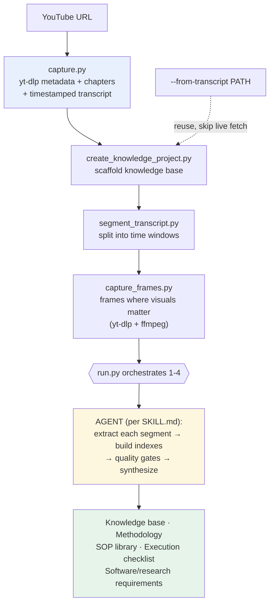

# learn-from-yt

Turn long videos, podcasts, courses, talks, or lectures into **structured operating knowledge** — knowledge bases, business methodologies, SOPs, execution plans, and downstream software/research requirements.

This skill is **self-contained**: it captures the source *and* processes it. One skill, one execution chain. (It absorbs what used to be a separate `youtube-knowledge` capture skill.)

## What it does

It runs a source through a mechanical capture/prep chain, then the agent performs the judgment-heavy extraction and synthesis on top.



Mechanical stages (1–4) are deterministic scripts driven by `run.py`. The final stage (extraction + synthesis) is done by the agent following `SKILL.md`, because it requires judgment.

## What it uses

| Dependency | Purpose | Install |
|---|---|---|
| `yt-dlp` | video metadata, chapters, subtitles, frame-source download | `pip install yt-dlp` |
| `ffmpeg` | extract frames from downloaded segments | `brew install ffmpeg` |
| `youtube-transcript-api` | transcript fallback when yt-dlp subs unavailable | `pip install youtube-transcript-api` |
| Python 3.9+ | runs the scripts | — |

> **Rate limits:** YouTube throttles heavy IPs with HTTP 429. When that happens, live capture/frames fail temporarily. Use `--from-transcript` to run against an already-captured transcript, or wait ~30–60 min for the limit to clear.

## Usage — one command

```bash
python3 scripts/run.py "YOUTUBE_URL" \
  --root ./Knowledge --domain "print-on-demand business" --minutes 10 --frame-interval 30
```

### Parameters

| Flag | Default | Meaning |
|---|---|---|
| `url` (positional) | — | YouTube URL (still passed with `--from-transcript` for metadata/frames) |
| `--root` | `./Knowledge` | root output folder |
| `--domain` | `business-building` | topic label used in the scaffold |
| `--minutes` | `10` | transcript segment window size |
| `--frame-interval` | `30` | seconds between captured frames |
| `--no-frames` | off | skip the visual/frame stage |
| `--capture-only` | off | capture source artifacts, then stop |
| `--from-transcript PATH` | — | reuse an existing transcript, skip live fetch (429-safe) |

### Individual scripts (advanced)

- `capture.py URL --wiki-root DIR` → `metadata.json`, `source.md`, `raw/transcript.md`
- `create_knowledge_project.py --root DIR --title T --domain D --url U` → knowledge-base scaffold
- `segment_transcript.py TRANSCRIPT --out-dir DIR --minutes N` → segmented markdown
- `capture_frames.py URL --out-dir DIR --start --end --every-seconds N` → frames

## Output it produces

```
Knowledge/
  raw-captures/<slug>/
    metadata.json          # title, channel, duration, chapters, url, views
    source.md              # human-readable summary + chapters
    raw/transcript.md      # full timestamped transcript
    segments/              # transcript split into windows (001-*.md, index.md)
    visuals/frames/        # extracted frames (when visuals matter)
  projects/<domain>/<slug>/
    source-card.md  source-manifest.md  extraction-log.md
    methodology.md  business-plan.md  execution-plan.md
    open-questions.md  sop/  visuals/
```

The agent then fills these with extracted, cited knowledge per `references/extraction-schema.md` and gates each stage with `references/quality-gates.md`.

## Install

```bash
./install-skill.sh --claude      # Claude Code (~/.claude/skills)
./install-skill.sh --codex       # Codex (~/.codex/skills)
./install-skill.sh --all         # both
./install-skill.sh --hermes-dir /opt/data/skills
```

## Design notes

- **Obsidian is the intended single source of truth.** Capture to local markdown first, then mirror into the vault.
- Capture is a **callable sub-step** (`--capture-only`) so a bare transcript grab is still possible without the full run.
- The extraction/synthesis stages are deliberately agent-driven, not scripted — they need judgment, and scripting them would produce shallow summaries.
